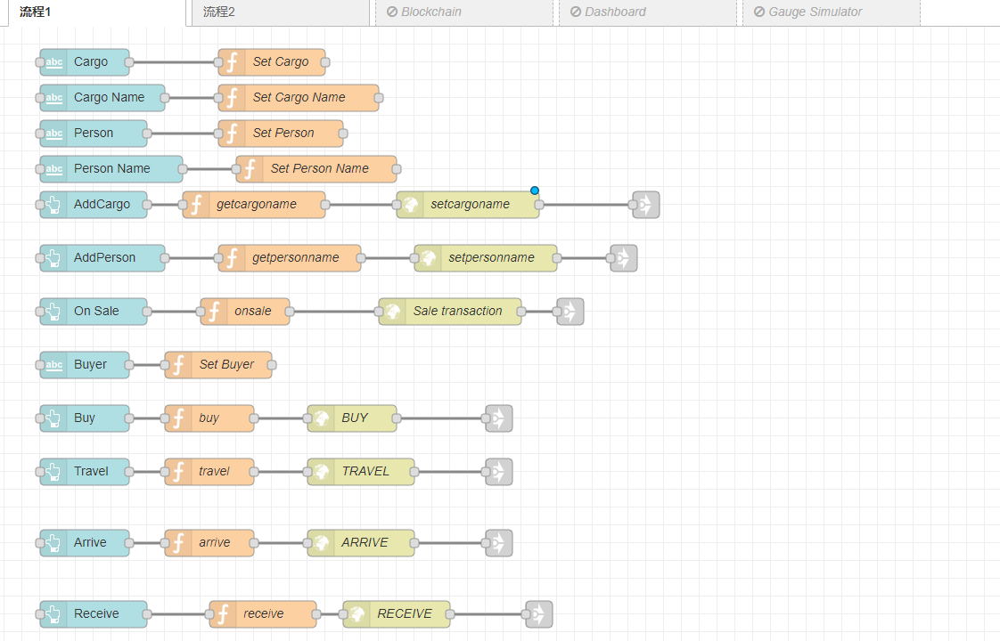
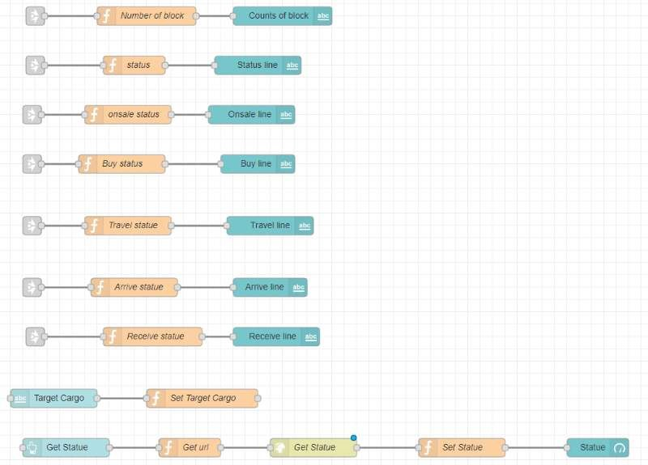
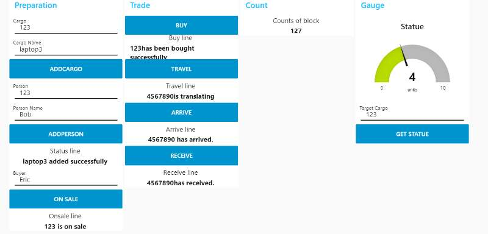

# Logistics Network

> 这是利用Hyperledger Composer开发的物流网络系统,模拟了从发布货物到购买货物,发货收货的全部状态,以区块链的技术来保证物流信息的公开,透明

网络相关定义:

**Participant**
`Person`

**Asset**
`Cargo`

**Transaction**
`CargoOnSell,BuyCargo,Transit,CargoArrive,ReceiveCargo`

货物被某个人所拥有，当人想发售自己的货物时，通过`CargoOnSell`发售货物，而后分别通过另外定义的四个事务来使货物处于正常、待发货、运输中、待签收等状态之中

Create a `Person` participant:

```
{
  "$class": "org.logistics.Person",
  "PersonId": "Toby",
  "PersonName": "Tobias",
}
```

Create a `Cargo` asset:

```
{
  "$class": "org.logistics.Cargo",
  "CargoId": "1",
  "CargoName":"1",
  "IsOnSell":false,
  "CargoCondition":"normal",
  "owner": "resource:org.logistics.Person#Toby"
}
```

Submit a `CargoOnSell` transaction:

```
{
  "$class": "org.logistics.CargoOnSell",
  "Item": "resource:org.logistics.Cargo#1",
  "Seller": "resource:org.logistics.Person#Toby"
}
```

提交事务后，该人所拥有的货物就变为发售状态，可以被其他潜在客户是查看、购买，这样一个事务就提交成功了！

NodeRed设计：


我们对于输入部分的解析和处理是流程1所做，我们取得输入并且通过http请求，访问部署的网络实现后端的更改。

我们对每个操作输出对应的信息显示成功与否，并且用一个仪表盘实现根据某个货物ID状态显示其交易过程的完成度。

界面展示：



## License <a name="license"></a>
Hyperledger Project source code files are made available under the Apache License, Version 2.0 (Apache-2.0), located in the LICENSE file. Hyperledger Project documentation files are made available under the Creative Commons Attribution 4.0 International License (CC-BY-4.0), available at http://creativecommons.org/licenses/by/4.0/.
