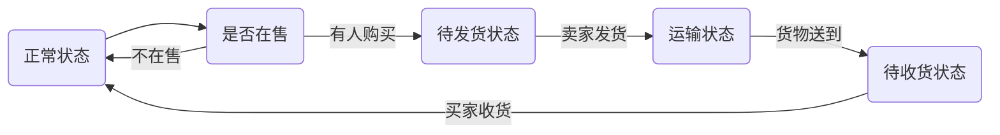

# Logistics Network

> 这是利用Hyperledger Composer开发的物流网络系统,模拟了从发布货物到购买货物,发货收货的全部状态,以区块链的技术来保证物流信息的公开,透明

## 设计思路
首先我们的目的是构建一个物流网络系统，利用区块链技术的特性来保证信息的公开，透明，不可篡改，即方便卖家观察售货情况调整资金动向，也能方便买家合理维权，即时处理快递。

那么一定会有用户与货物的概念，货物会被某个用户所拥有，用户可以选择是否发售货物，而为了更加确切的监控物流系统，我们将货物状态设为：*normal*,*unfilled*,*transit*,*wait_for_sign*四个状态，整体物流的流程如下：

除此以外，物流系统还应该能够查询某个具体的用户所拥有的货物具体是哪些，而对于不是自己拥有的货物，试图对其进行操作应予以拒绝

## 模型定义

**Participant**
`Person`

**Asset**
`Cargo`

**Transaction**
`CargoOnSell,BuyCargo,Transit,CargoArrive,ReceiveCargo`

**enum**
```
CargoType{
  o unfilled
  o transit
  o wait_for_sign
  o normal
}
```

提交时的样例如下：

Create a `Person` particant:
```
{
  "$class": "org.logistics.Person",
  "PersonId": "Toby",
  "PersonName": "Tobias",
}
```

Create a `Cargo` asset:

```
{
  "$class": "org.logistics.Cargo",
  "CargoId": "1",
  "CargoName":"1",
  "IsOnSell":false,
  "CargoCondition":"normal",
  "owner": "resource:org.logistics.Person#Toby"
}
```

Submit a `CargoOnSell` transaction:

```
{
  "$class": "org.logistics.CargoOnSell",
  "Item": "resource:org.logistics.Cargo#1",
  "Seller": "resource:org.logistics.Person#Toby"
}
```
## 逻辑控制

对于每个事务，为了保证安全性，需要先检查提交事务的人与货物拥有者是否匹配，而对于物流中对于货物状态改变的事务，还要额外检查货物是否处于正确状态，否则该事务将不能提交，从而确保物流系统的一致性

## 权限控制

为了体现物流系统的透明性，用户将可以看到所有的事务但只能对自己拥有的物品进行操作，网络管理员遵从原有的权限设计不作改动

## 查询信息

我们需要写一个额外的查询来对某个用户拥有的货物进行快速查询，这里的查询就是起到这个作用的，具体如下：
```
query OwnItem {
    description: "Select all Items owned by Person"
    statement:
        SELECT org.logistics.Cargo
            WHERE (_$nameparam==owner.PersonName )
}
```
即根据传入参数返回所有得到的货物信息

## 结语

区块链技术是有着实际应用背景的技术，我们应依托实际情况开发应用，合理利用资源，提高生活品质